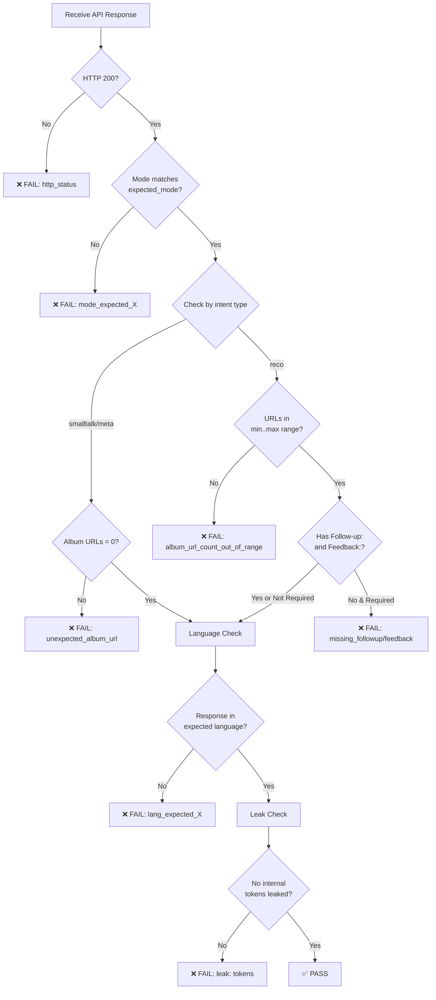
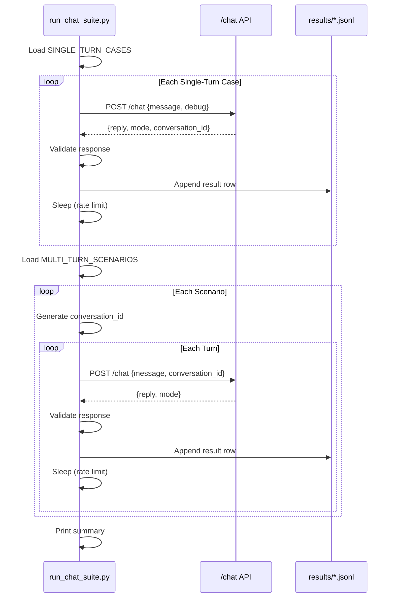
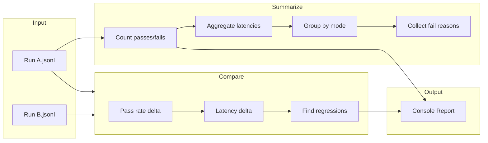

# Evaluation Suite Documentation

**Stage+ Concierge API — Quality Assurance & Regression Testing**

---

## Overview

The `/eval` directory contains an automated test suite for validating the Stage+ Concierge chat API. It tests intent routing, response quality, language handling, and ensures no internal implementation details leak to users.

```
eval/
├── chat_suite_cases.py    # Test case definitions
├── run_chat_suite.py      # Test runner
├── score_chat_suite.py    # Results analyzer & comparator
└── results/               # JSONL output files
    └── .gitkeep
```

---

## Architecture

```mermaid
flowchart TB
    subgraph TestDefinitions["📋 Test Definitions"]
        ST[SINGLE_TURN_CASES<br/>46 cases]
        MT[MULTI_TURN_SCENARIOS<br/>5 scenarios, 15 turns]
    end

    subgraph Runner["🏃 Test Runner"]
        RUN[run_chat_suite.py]
        POST[POST /chat]
        CHECK[Validation Logic]
    end

    subgraph API["🎯 Concierge API"]
        CHAT[/chat endpoint]
    end

    subgraph Scoring["📊 Scoring"]
        SCORE[score_chat_suite.py]
        COMPARE[Run Comparison]
    end

    subgraph Output["📁 Output"]
        JSONL[results/*.jsonl]
        SUMMARY[Console Summary]
    end

    ST --> RUN
    MT --> RUN
    RUN --> POST
    POST --> CHAT
    CHAT --> CHECK
    CHECK --> JSONL
    JSONL --> SCORE
    SCORE --> SUMMARY
    SCORE --> COMPARE
```

---

## Test Case Structure

### Single-Turn Cases

Each test case validates a single message/response pair:

```python
{
    "id": "reco_bach",              # Unique identifier
    "message": "Bach",              # User input
    "expected_mode": "reco",        # Expected intent: reco | smalltalk | meta
    "lang_seen": "en",              # Expected response language: en | de | ja
    "min_album_urls": 1,            # Minimum album links expected
    "max_album_urls": 3,            # Maximum album links expected
    "require_followup_feedback": True  # Must include Follow-up: and Feedback:
}
```

### Multi-Turn Scenarios

Scenarios test conversation continuity across multiple exchanges:

```python
{
    "id": "mt_en_jazz_refine",
    "turns": [
        {"id": "turn_1", "message": "yo", "expected_mode": "smalltalk", ...},
        {"id": "turn_2", "message": "give me some jazz", "expected_mode": "reco", ...},
        {"id": "turn_3", "message": "more like #1 but calmer", "expected_mode": "reco", ...}
    ]
}
```

---

## Test Categories

### By Intent Type

| Intent | Description | Album URLs Expected | Example Messages |
|--------|-------------|---------------------|------------------|
| `smalltalk` | Greetings, thanks, help | 0 | "yo", "hi there", "👍", "what can you do?" |
| `meta` | Questions about the concierge | 0 | "who are you?", "why these picks?", "that was great!" |
| `reco` | Music recommendation requests | 1-3 | "Bach", "jazz", "something calming" |

### By Language

| Language | Code | Detection Method |
|----------|------|------------------|
| English | `en` | Default (always passes) |
| German | `de` | Presence of: ä, ö, ü, ß, or tokens like " und ", " für " |
| Japanese | `ja` | Hiragana (U+3040-30FF) or Kanji (U+4E00-9FFF) |

### Coverage Summary

```
Single-Turn Cases: 46
├── smalltalk: 6 cases
├── meta: 7 cases
└── reco: 33 cases
    ├── Vibe/mood: 5 (calming, energetic, study, dinner, children)
    ├── Composer/work: 10 (Bach, Beethoven, Mozart, Mahler, etc.)
    ├── Genre/style: 8 (jazz, opera, baroque, etc.)
    ├── Instrument: 3 (piano, violin, cello)
    ├── Special: 4 (Atmos, hidden gems, no vocals, Christmas)
    └── Multilingual: 3 (German, Japanese variants)

Multi-Turn Scenarios: 5 (15 total turns)
├── English jazz refinement
├── English baroque opera refinement
├── English constraints + continue
├── German sleep music refinement
└── Japanese study music refinement
```

---

## Validation Logic



### Leak Detection

The suite checks for internal implementation details that should never appear in user-facing responses:

```python
LEAK_TOKENS = [
    "Candidate JSON",
    "routing",
    "router",
    "rank_by",
    "filters_relaxed",
    "system prompt"
]
```

### Album URL Extraction

URLs are extracted using this pattern:

```regex
https?://[^\s)]+/audio/album_[A-Za-z0-9]+
```

---

## Running the Suite

### Basic Usage

```bash
# Run against local server
python eval/run_chat_suite.py --base-url http://localhost:8000

# Run against production (Render)
python eval/run_chat_suite.py \
  --base-url https://concierge-plus-api.onrender.com \
  --sleep-ms 800
```

### CLI Options

| Option | Default | Description |
|--------|---------|-------------|
| `--base-url` | `http://localhost:8000` | API base URL |
| `--out` | `eval/results/chat_suite_{timestamp}.jsonl` | Output file path |
| `--sleep-ms` | `250` | Delay between requests (rate limiting) |
| `--timeout` | `60` | Request timeout in seconds |
| `--debug` | `true` | Include debug info in requests |
| `--include-multiturn` | `true` | Run multi-turn scenarios |

### Execution Flow



---

## Output Format

### JSONL Row Structure

Each test produces a JSON line:

```json
{
  "run_id": "uuid",
  "ts_utc": "2025-01-19T12:00:00Z",
  "case_id": "reco_bach",
  "message": "Bach",
  "expected": {
    "expected_mode": "reco",
    "lang_seen": "en",
    "min_album_urls": 1,
    "max_album_urls": 3,
    "require_followup_feedback": true
  },
  "status_code": 200,
  "response_json": {
    "reply": "Looking for Bach...",
    "mode": "reco",
    "conversation_id": "uuid",
    "debug": {...}
  },
  "latency_ms": 2450,
  "extracted_album_urls": [
    "https://www.stage-plus.com/audio/album_ABC123"
  ],
  "pass": true,
  "fail_reasons": []
}
```

### Multi-Turn Additional Fields

```json
{
  "scenario_id": "mt_en_jazz_refine",
  "turn_idx": 2,
  ...
}
```

---

## Scoring & Analysis

### Basic Scoring

```bash
python eval/score_chat_suite.py eval/results/chat_suite_20250119.jsonl
```

Output:

```
Chat suite score
Total: 61  Pass: 58  Fail: 3
Pass rate: 95.08%
Avg latency: 2340 ms
Failures:
- reco_xmas_ja
- mt_de_sleep_refine_3
- reco_atmos
Failure reasons:
- missing_followup: 2
- lang_expected_ja: 1
Expected mode counts:
- smalltalk: 8
- meta: 7
- reco: 46
```

### Run Comparison

Compare two runs to detect regressions:

```bash
python eval/score_chat_suite.py \
  eval/results/chat_suite_new.jsonl \
  --compare eval/results/chat_suite_baseline.jsonl
```

Output:

```
Comparison
Pass rate delta: -2.00%
Avg latency delta: 150 ms
Fails delta: 2
Missing cases in compare run:
- reco_new_case
```

### Scoring Flow



---

## Metrics Collected

| Metric | Description | Use Case |
|--------|-------------|----------|
| **Pass Rate** | % of tests passing all validations | Overall quality gate |
| **Avg Latency** | Mean response time (ms) | Performance monitoring |
| **Mode Accuracy** | Correct intent classification | Router quality |
| **Language Accuracy** | Responses in expected language | i18n quality |
| **Leak Rate** | Internal details exposed | Security/UX |
| **URL Count** | Album links per response | Recommendation completeness |

---

## CI/CD Integration

### Suggested GitHub Action

```yaml
name: Eval Suite
on: [push, pull_request]

jobs:
  eval:
    runs-on: ubuntu-latest
    steps:
      - uses: actions/checkout@v4

      - name: Setup Python
        uses: actions/setup-python@v5
        with:
          python-version: '3.11'

      - name: Install dependencies
        run: pip install -r requirements.txt

      - name: Start server
        run: |
          uvicorn api_server:app --port 8000 &
          sleep 10
        env:
          ANTHROPIC_API_KEY: ${{ secrets.ANTHROPIC_API_KEY }}
          CATALOG_CSV_PATH: ${{ secrets.CATALOG_CSV_PATH }}

      - name: Run eval suite
        run: python eval/run_chat_suite.py --base-url http://localhost:8000

      - name: Score results
        run: |
          LATEST=$(ls -t eval/results/*.jsonl | head -1)
          python eval/score_chat_suite.py "$LATEST"

      - name: Upload results
        uses: actions/upload-artifact@v4
        with:
          name: eval-results
          path: eval/results/*.jsonl
```

### Quality Gates

| Gate | Threshold | Action |
|------|-----------|--------|
| Pass Rate | ≥ 90% | Block merge if below |
| Avg Latency | ≤ 5000ms | Warning if exceeded |
| Leak Detection | 0 leaks | Block merge if any |

---

## Adding New Test Cases

### Single-Turn Case

Add to `chat_suite_cases.py`:

```python
SINGLE_TURN_CASES.append({
    "id": "reco_new_feature",        # Unique, descriptive ID
    "message": "your test message",
    "expected_mode": "reco",         # reco | smalltalk | meta
    "lang_seen": "en",               # en | de | ja
    "min_album_urls": 1,
    "max_album_urls": 3,
    "require_followup_feedback": True,
})
```

### Multi-Turn Scenario

```python
MULTI_TURN_SCENARIOS.append({
    "id": "mt_new_scenario",
    "turns": [
        {
            "id": "mt_new_scenario_1",
            "message": "first message",
            "expected_mode": "smalltalk",
            "lang_seen": "en",
            "min_album_urls": 0,
            "max_album_urls": 0,
            "require_followup_feedback": False,
        },
        {
            "id": "mt_new_scenario_2",
            "message": "follow-up message",
            "expected_mode": "reco",
            "lang_seen": "en",
            "min_album_urls": 1,
            "max_album_urls": 3,
            "require_followup_feedback": True,
        },
    ],
})
```

---

## Troubleshooting

### Common Failures

| Failure Reason | Likely Cause | Fix |
|----------------|--------------|-----|
| `http_529` | API rate limited | Increase `--sleep-ms` |
| `mode_expected_reco` | Router misclassified | Check router prompt |
| `album_url_count_out_of_range` | Catalog search issue | Check catalog loading |
| `missing_followup` | Writer prompt issue | Check RECO_OUTPUT_FORMAT |
| `lang_expected_de` | No German in response | Check SYSTEM_PROMPT language rules |
| `leak: Candidate JSON` | Internal details exposed | Check writer prompt |

### Debug Mode

Enable debug output in responses:

```bash
python eval/run_chat_suite.py --debug true
```

Response will include:

```json
{
  "debug": {
    "used_catalog": true,
    "candidate_count": 12,
    "timings_ms": {
      "router_ms": 180,
      "catalog_search_ms": 45,
      "writer_ms": 2100,
      "total_ms": 2400
    },
    "filters_relaxed": false
  }
}
```

---

*Document version: 1.0*
*Last updated: January 2025*
